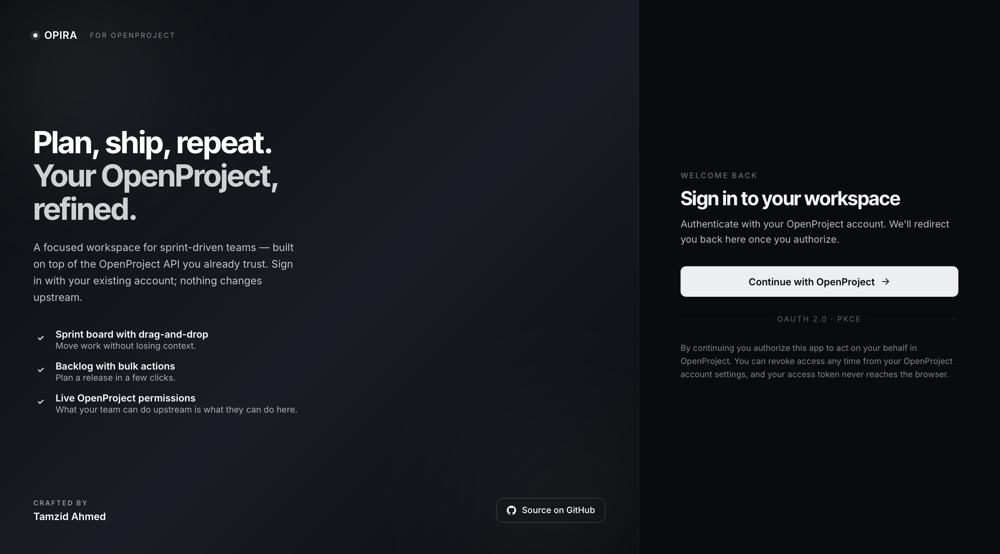

<div align="center">

# Opira

### The Jira-grade UI your OpenProject deserves.

**Opira** is a modern, opinionated, **read-write** front-end for [OpenProject](https://www.openproject.org/) — sprint board, backlog, timeline, reports, documents, command palette, the lot — served from a Next.js 16 app that talks to *your* OpenProject instance over OAuth 2.0 + the v3 HAL API.

> No shadow database. No background workers. No vendor lock-in. **Your OpenProject is the source of truth — Opira is just the cockpit.**

[](https://nextjs.org/)
[](https://react.dev/)
[](https://tailwindcss.com/)
[](https://authjs.dev/)
[](https://tanstack.com/query)
[](./LICENSE)
[](./CONTRIBUTING.md)
[](https://github.com/tamzid958)

[Quick Start](#-quick-start) · [Docker](#-docker) · [Configuration](#-configuration) · [Architecture](#-architecture) · [Roadmap](#-roadmap) · [Contributing](#-contributing)

</div>

---

## 📚 Table of contents

1. [Why Opira](#-why-opira)
2. [Feature matrix](#-feature-matrix)
3. [Screenshots](#-screenshots)
4. [Quick start](#-quick-start)
5. [Docker](#-docker)
6. [Configuration](#-configuration)
7. [Register the OAuth client](#-register-the-oauth-client-in-openproject)
8. [Routes & deep links](#-routes--deep-links)
9. [Architecture](#-architecture)
10. [Project layout](#-project-layout)
11. [Tech stack](#-tech-stack)
12. [Scripts](#-scripts)
13. [Performance & footprint](#-performance--footprint)
14. [Security model](#-security-model)
15. [Roadmap](#-roadmap)
16. [Contributing](#-contributing)
17. [FAQ](#-faq)
18. [License & credits](#-license--credits)

---

## 🚀 Why Opira

OpenProject is a powerful, open-source, fully-featured project management server. Its UI is comprehensive — and that is precisely the problem. Teams arriving from Jira, Linear, or Shortcut often find the screens dense, the keyboard shortcuts sparse, and the daily-driver flows (board → backlog → sprint review) more clicks than they should be.

**Opira fixes the front-end without forking the back-end.**

| | Stock OpenProject UI | **Opira** |
|---|---|---|
| Sprint board | Generic board macro | Per-sprint kanban with status-aware columns, **drag-and-drop**, swimlanes |
| Backlog | Work-package list | Sprint-grouped sections, **bulk move/assign/delete**, sub-task expansion |
| Sprints | Versions screen | Native lifecycle (`open` → `locked` → `closed`) with start/complete/lock modals |
| Reports | External plugin | **Burndown + velocity** built-in, per sprint |
| Search | Page-level filters | **⌘K command palette** — projects, work packages, people |
| Permissions | Role-name guesswork | Driven by **live `_links` from each resource** |
| Stack | Rails + ERB | **Next.js 16 · React 19 · Tailwind v4** |
| Lock-in | None — Opira is just a different lens on the same API | |

> Opira is a **front-end only**. Bring your own OpenProject server (self-hosted Community Edition runs in one `docker run`).

---

## 🎯 Feature matrix

<details open>
<summary><strong>Planning & execution</strong></summary>

- ✅ **Drag-and-drop sprint board**, scoped per sprint, with status-aware columns
- ✅ Filters: search · assignee · type · tag · status chip
- ✅ **Backlog** with bulk move, bulk assign, bulk delete, sub-task expansion
- ✅ **One-click sprint sync** — align dates, roll up story points
- ✅ Sprint lifecycle modals: create · edit · start · complete · lock · unlock · reopen
- ✅ **Timeline** view with sprint-grouped date bands
- ✅ **JSON import** — drop a tree of work packages into a sprint

</details>

<details open>
<summary><strong>Visibility & reporting</strong></summary>

- ✅ **Burndown** chart per sprint
- ✅ **Velocity** rollup across recent sprints
- ✅ **Documents** reader — two-pane, with embedded attachments proxied so they actually render
- ✅ Activity feed, watchers, file links, time entries, revisions, relations

</details>

<details open>
<summary><strong>Collaboration & quality of life</strong></summary>

- ✅ **⌘K / Ctrl-K command palette** — fast jumps across projects, work packages, members
- ✅ **Tiptap rich text** for descriptions and comments — sanitised on render
- ✅ **Notifications** with mark-all-read
- ✅ **Members** management with role chips and invite/remove flows
- ✅ **Tags** browser
- ✅ **Permission-aware UI** — every action button reflects the live `_links` of the resource
- ✅ **Reminders** panel, **shortcuts** modal, **offline queue** for resilient mutations
- ✅ Optimistic updates with rollback — the UI never lies to you

</details>

---

## 🖼 Screenshots

<div align="center">

<a href="./docs/screenshots/sign-in.png">
  
</a>

<sub><strong>Sign-in.</strong> OAuth 2.0 + PKCE against your OpenProject instance — the access token never reaches the browser.</sub>

</div>

---

## ⚡ Quick start

> **Prerequisites** — Node.js **22+**, npm 10+, and a reachable OpenProject **v3** instance you can sign in to as an administrator (to register the OAuth app).

```bash
# 1. Clone
git clone https://github.com/tamzid958/opira.git
cd opira

# 2. Install
npm install

# 3. Configure
cp .env.local.example .env.local      # fill in the four required values
$EDITOR .env.local

# 4. Run
npm run dev
```

Open <http://localhost:3000>. The first request bounces through OpenProject for OAuth sign-in.

> 💡 Don't have an OpenProject server handy? Start one in 30 seconds:
> ```bash
> docker run -d -p 8080:80 --name openproject openproject/openproject:14
> ```
> Then point `NEXT_PUBLIC_OPENPROJECT_URL` at `http://localhost:8080`.

---

## 🐳 Docker

Opira ships a multi-stage `Dockerfile` (~170 MB compressed, non-root, healthchecked) and a ready-to-run `docker-compose.yml`.

```bash
# 1. Configure
cp .env.local.example .env
$EDITOR .env                          # set AUTH_URL to the public origin

# 2. Build + run
docker compose up -d --build

# 3. Visit
open http://localhost:3000
```

Put a TLS-terminating reverse proxy (nginx, Traefik, your cloud's load balancer) **in front** of the container — Opira handles the app, not the edge.

> ⚠ `NEXT_PUBLIC_*` values are baked into the client bundle at build time. If you change them, rebuild: `docker compose build --no-cache opira`.

---

## ⚙ Configuration

| Variable | Required | Purpose |
|---|:---:|---|
| `NEXT_PUBLIC_OPENPROJECT_URL` | ✅ | Base URL of your OpenProject instance, e.g. `https://op.example.com`. Used by both server (OAuth + proxy) and client (account deep-link). |
| `OPENPROJECT_OAUTH_CLIENT_ID` | ✅ | Client ID of the OAuth application registered in OpenProject. |
| `OPENPROJECT_OAUTH_CLIENT_SECRET` | ✅ | Matching client secret. |
| `AUTH_SECRET` | ✅ | 32+ byte secret signing NextAuth cookies. Generate: `openssl rand -base64 32`. |
| `AUTH_URL` | prod only | Public origin. Auto-detected in dev; **set explicitly in production**. |
| `NEXT_PUBLIC_OPENPROJECT_STORY_POINTS_FIELD` | optional | Field carrying story points. Top-level numeric (`storyPoints`, default) or a custom-field key (`customField7`). |

Server-only secrets (`AUTH_SECRET`, `OPENPROJECT_OAUTH_CLIENT_SECRET`) are read at runtime and **never reach the browser**.

---

## 🔑 Register the OAuth client in OpenProject

1. Sign in to your OpenProject instance as an administrator.
2. Navigate to **Administration → Authentication → OAuth applications → Add**.
3. Fill the form:

   | Field | Value |
   |---|---|
   | **Name** | `Opira` (or anything memorable) |
   | **Redirect URI** | `<AUTH_URL>/api/auth/callback/openproject`<br>_locally:_ `http://localhost:3000/api/auth/callback/openproject` |
   | **Confidential** | ✅ yes |
   | **Scopes** | `api_v3` |

4. **Save**, then copy the generated **Client ID** and **Client Secret** into `.env.local`.

> Refresh tokens rotate transparently in [auth.js](./auth.js) with a 60s buffer; failures set `token.error = "RefreshAccessTokenError"` and redirect to `/sign-in`.

---

## 🧭 Routes & deep links

| Path | Purpose |
|---|---|
| `/` | Redirects to `/projects`. |
| `/projects` | Bounces to your last-visited project, or the first one you can access. |
| `/projects/<id>/board` | Sprint board with filters and switcher. |
| `/projects/<id>/backlog` | Sprint sections with bulk operations. |
| `/projects/<id>/timeline` | Calendar-style timeline. |
| `/projects/<id>/reports` | Burndown + velocity. |
| `/projects/<id>/overview` | Project dashboard. |
| `/projects/<id>/tags` | Categories browser. |
| `/projects/<id>/members` | Project memberships. |
| `/projects/<id>/documents` | Documents reader. |
| `/account` | Identity + deep-link to OpenProject account settings. |

**Modal state rides URL params** — `?wp=<id>` opens a work package, `?create=1` opens the create dialog, `?s=<id>` selects a board sprint. Deep links are shareable and the back button just works.

---

## 🏗 Architecture

Three layers, one promise: **the access token never touches the browser.**

```
┌──────────────────────────────────────────────────────────────────────┐
│                              BROWSER                                 │
│  React 19 components ── TanStack Query hooks ── URL params (state)   │
└────────────────────────────────┬─────────────────────────────────────┘
                                 │  fetchJson()  (lib/api-client.js)
                                 ▼
┌──────────────────────────────────────────────────────────────────────┐
│                  NEXT.JS SERVER  (route handlers)                    │
│  app/api/openproject/*  ── opFetch / opPatchWithLock / errorResponse │
│  Reads OAuth bearer from session, injects Authorization header       │
└────────────────────────────────┬─────────────────────────────────────┘
                                 │  HTTPS  (HAL JSON)
                                 ▼
┌──────────────────────────────────────────────────────────────────────┐
│              OPENPROJECT v3 API  (your instance)                     │
│  Permissions · work packages · versions (sprints) · users · …        │
└──────────────────────────────────────────────────────────────────────┘
```

**Layer 1 — Authentication** ([auth.js](./auth.js))
Hand-rolled OAuth provider (OpenProject has no OIDC discovery). JWT callback rotates refresh tokens with a 60s buffer; [auth.config.js](./auth.config.js) is the edge-safe slice consumed by middleware.

**Layer 2 — Server proxy** ([app/api/openproject/](./app/api/openproject))
Every browser request to OpenProject is brokered server-side. The OAuth bearer is read from the session and injected here. Use [`opFetch` / `opPatchWithLock` / `fetchAllPages`](./lib/openproject/client.js) — never `fetch` against OpenProject directly from a route handler.

**Layer 3 — Client** ([components/](./components))
Feature components consume hooks from [lib/hooks/](./lib/hooks). Mutations are optimistic with rollback. Modal state lives in URL params so deep links and back/forward behave like the rest of the web.

### The bits that bite (read before editing the API layer)

- 🔒 **Optimistic locking** — most resources carry `lockVersion`. `PATCH` without it fails 409. Use [`opPatchWithLock`](./lib/openproject/client.js) — auto-fetches the current `lockVersion` and retries once on conflict. Surface `LOCK_CONFLICT` as _"someone else updated this — refresh"_.
- 🔗 **HAL JSON everywhere** — collections under `_embedded.elements`, navigation/permissions under `_links`. Flatten through [lib/openproject/mappers.js](./lib/openproject/mappers.js); never leak HAL into components.
- 🛡 **Live permissions** — each resource's `_links` says what the *current* user can do. Drive enabled/disabled state via [`usePermissions`](./lib/hooks/use-permissions.js); never re-derive from role names.
- 🧮 **Filters are JSON** — OpenProject's `filters` query param is a JSON-encoded array of `{ field: { operator, values } }`. Use [`buildFilters`](./lib/openproject/client.js).
- 📄 **Pagination** — max `pageSize` is 1000, pages are 1-indexed via `offset`. Walk with [`fetchAllPages`](./lib/openproject/client.js) (default cap 5000).
- 🎯 **Story points field is configurable** — always read through [lib/openproject/story-points.js](./lib/openproject/story-points.js); never hardcode.
- 🏃 **Sprints are OpenProject `version` resources** with `open / locked / closed` statuses. There is no separate sprint entity.

---

## 📂 Project layout

```text
opira/
├─ app/                                  Next.js App Router
│  ├─ layout.jsx                         root server layout
│  ├─ loading.jsx · error.jsx · not-found.jsx
│  ├─ page.jsx                           redirect → /projects
│  ├─ projects/
│  │  ├─ page.jsx                        project picker
│  │  └─ [projectId]/
│  │     ├─ layout.jsx                   chrome + cross-page modals
│  │     ├─ board/page.jsx
│  │     ├─ backlog/page.jsx
│  │     ├─ timeline/page.jsx
│  │     ├─ reports/page.jsx
│  │     ├─ overview/page.jsx
│  │     ├─ tags/page.jsx
│  │     ├─ members/page.jsx
│  │     └─ documents/page.jsx
│  ├─ api/openproject/*                  authenticated proxy routes
│  └─ account/page.jsx
├─ components/
│  ├─ ui/                                shared primitives (Avatar, Menu, …)
│  └─ …                                  feature components
├─ lib/
│  ├─ hooks/                             TanStack Query wrappers, URL helpers
│  ├─ openproject/                       mappers, OAuth client, route utils
│  ├─ offline/                           offline queue + runner
│  └─ server/                            server-only helpers
├─ auth.js · auth.config.js              NextAuth wiring
├─ Dockerfile · docker-compose.yml       container build + stack
├─ next.config.mjs · postcss.config.mjs · eslint.config.mjs
└─ jsconfig.json                         '@/*' path alias
```

---

## 🧰 Tech stack

| Layer | Choice | Why |
|---|---|---|
| Framework | [Next.js 16](https://nextjs.org/) (App Router, Turbopack) | RSC + route handlers + standalone output |
| UI runtime | [React 19](https://react.dev/) | actions, transitions, suspense |
| Styling | [Tailwind CSS v4](https://tailwindcss.com/) | tokens declared once in `app/globals.css` |
| Data | [TanStack Query v5](https://tanstack.com/query) | optimistic mutations + rollback |
| Auth | [NextAuth.js v5](https://authjs.dev/) | OAuth 2.0 + PKCE, refresh-token rotation |
| Forms | [react-hook-form](https://react-hook-form.com/) + [zod](https://zod.dev/) | validation + shape inference |
| Editor | [Tiptap](https://tiptap.dev/) + [DOMPurify](https://github.com/cure53/DOMPurify) | rich text, sanitised on render |
| DnD | [dnd-kit](https://dndkit.com/) | accessible drag-and-drop |
| Icons | [lucide-react](https://lucide.dev/) | tree-shakeable |
| Toasts | [sonner](https://sonner.emilkowal.ski/) | minimal, themed |
| Lang | **JavaScript + JSDoc** (not TypeScript by design) | `@/*` alias via `jsconfig.json` |

---

## 🛠 Scripts

| Command | What it does |
|---|---|
| `npm run dev` | Start the dev server with Turbopack on `:3000`. |
| `npm run build` | Production build → `.next/standalone`. |
| `npm run start` | Run the production build locally. |
| `npm run lint` | ESLint via `eslint-config-next`. |

> No test suite ships in this repo today. Don't add one without first agreeing on the testing strategy with the maintainer — see [CONTRIBUTING.md](./CONTRIBUTING.md#before-you-open-a-pr).

---

## 📦 Performance & footprint

- **Image size** — ~170 MB compressed, multi-stage build, distroless-style alpine runner, non-root (`uid 1001`).
- **Cold build** — ~2 min on a fresh machine; **~10 s** on a code-only change thanks to the `deps` cache layer.
- **Production bundle** — `console.log/info/debug` are stripped (see [next.config.mjs](./next.config.mjs)); `error` and `warn` survive.
- **Health probe** — `HEALTHCHECK` accepts any 1xx-4xx (a 307 to `/sign-in` means the server is up and routing).

---

## 🛡 Security model

- **Access tokens are server-side only.** The OAuth bearer is injected in route handlers and never serialised to the client.
- **Refresh tokens rotate** with a 60s buffer; rotation failures redirect to `/sign-in`.
- **HTML user content** (descriptions, comments) is **always** sanitised with `isomorphic-dompurify` on render. Never `dangerouslySetInnerHTML` raw OpenProject HTML.
- **Permissions are not duplicated** in the client — every action button reads the live `_links` returned by the resource.
- **CSRF** is handled by NextAuth's signed session cookies + same-origin proxy routes.

Suspected vulnerabilities → please report privately per [SECURITY.md](./SECURITY.md). Do **not** open a public issue.

---


## 🤝 Contributing

PRs welcome — small or large. The full guide lives in [CONTRIBUTING.md](./CONTRIBUTING.md). The 30-second version:

```bash
# Fork on GitHub, then:
git clone https://github.com/<your-fork>/opira.git
cd opira
git checkout -b feat/<short-name>      # or fix/<…>, docs/<…>, refactor/<…>

# …make your changes…

npm run lint && npm run build          # both must pass
git add -A
git commit -m "feat(board): swimlanes by assignee"
git push -u origin feat/<short-name>

# Open a PR against `master`. Attach a screen-record for any UI change.
```

**Branch & commit conventions**

| Prefix | Use for |
|---|---|
| `feat/` · `feat:` | net-new user-visible feature |
| `fix/` · `fix:` | bug fix |
| `refactor/` · `refactor:` | internal change, no behaviour shift |
| `docs/` · `docs:` | README, JSDoc, in-repo guides |
| `chore/` · `chore:` | tooling, deps, infra |
| `test/` · `test:` | tests only |

Everyone interacting in project spaces follows the [Code of Conduct](./CODE_OF_CONDUCT.md).

---

## ❓ FAQ

<details>
<summary><strong>Does Opira store any of my data?</strong></summary>

No. There is no application database, no cache server, no analytics. Every screen reads live from your OpenProject instance, every mutation is round-tripped to it. The only persistent state Opira owns is your signed session cookie.
</details>

<details>
<summary><strong>Can I run Opira against OpenProject Cloud?</strong></summary>

Yes — point `NEXT_PUBLIC_OPENPROJECT_URL` at your hosted instance and register the OAuth app under your cloud admin. Opira doesn't care whether the server is self-hosted or hosted by Greenkeeper GmbH.
</details>

<details>
<summary><strong>Why JavaScript and not TypeScript?</strong></summary>

Pragmatism. The codebase uses JSDoc + `jsconfig.json` for editor tooling and avoids the TS toolchain tax. PRs that flip files to `.ts`/`.tsx` will be declined.
</details>

<details>
<summary><strong>Does Opira replace OpenProject?</strong></summary>

No. Opira is a **front-end only** — it has zero meaning without an OpenProject server behind it. Think "Insomnia for REST" or "TablePlus for Postgres" — same data, different cockpit.
</details>

<details>
<summary><strong>How do permissions work?</strong></summary>

OpenProject returns a `_links` object on every resource that lists the actions the *current* user can perform. Opira reads that directly via [`usePermissions`](./lib/hooks/use-permissions.js) and gates every button accordingly. There is no role-name table to keep in sync.
</details>

<details>
<summary><strong>What about offline?</strong></summary>

Mutations queue in [lib/offline/](./lib/offline) when the network drops and replay when it returns. Reads are cached by TanStack Query.
</details>

---

## 📜 License & credits

[MIT](./LICENSE) © **Tamzid Ahmed**

Built on the shoulders of the [OpenProject](https://www.openproject.org/) team's excellent v3 API, the [Next.js](https://nextjs.org/) team's App Router, and every maintainer in the dependency tree above.

If Opira saves your team time, **⭐ star the repo** — that's how it finds its next user.

<div align="center">

**[⬆ back to top](#opira)**

</div>
